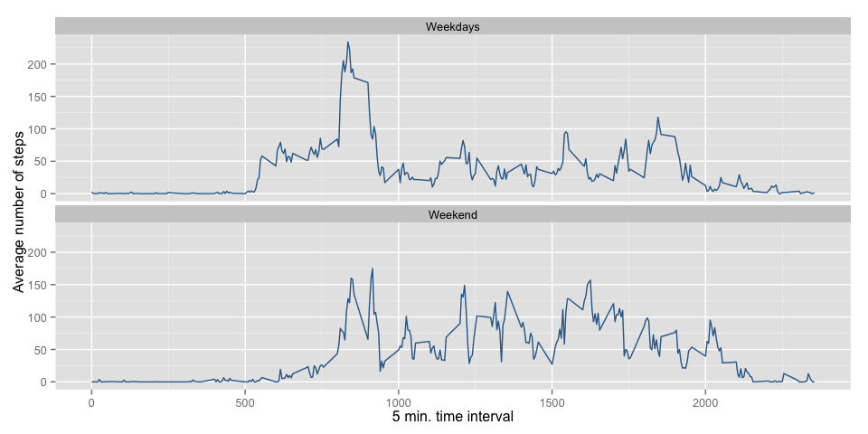

# Reproducible Research: Peer Assessment 1


## Loading and preprocessing the data

First of all, prepare the environment.


```r
library(magrittr)
library(dplyr)
library(data.table)
library(ggplot2)
rm(list = ls())
```

And then, read the raw data.


```r
data.raw <- read.csv("activity.csv", 
                     header = T, 
                     colClasses = c("integer", "Date", "integer"), 
                     na.strings = "NA")
```

The data set can be downloaded from the [course web site](https://d396qusza40orc.cloudfront.net/repdata%2Fdata%2Factivity.zip)

According to the instruction, the data consists 2 months of masked data from an individual during the months of October and November, 2012.

The variables included in the dataset are:

1. **steps**: Number of steps taking in a 5-minute interval (missing values are coded as NA)
2. **date**: The date on which the measurement was taken in YYYY-MM-DD format
3. **interval**: Identifier for the 5-minute interval in which measurement was taken


## What is mean total number of steps taken per day?

Now, calculate the total number of steps taken per day and its mean and median.


```r
# transform into data.table, so that processing would be much easier.
tbl.data <- data.table(data.raw)
# calculate the total number of steps taken per day
# thanks to the data.table library, it is done by single line code.
tbl.data.summary <- tbl.data[ , 
                              list(total_steps = sum(steps, na.rm = T), 
                                   total_steps_nachk = sum(steps, na.rm = F)), 
                              by = date]

# at here, total_steps would have 0 while all the records were NA.
# So, re-fill the total steps if a day is fully filled with NA.
tbl.data.summary$total_steps <- tbl.data.summary$total_steps * ifelse(tbl.data.summary$total_steps_nachk > 0, 1, 0)

 # calculate the mean and median
buf.mean <- mean(tbl.data.summary$total_steps, na.rm = T)
buf.median <- median(tbl.data.summary$total_steps, na.rm = T)

breaks <- 50
# and plot the histogram
hist(tbl.data.summary$total_steps, 
     main = "# Steps taken per day",
     xlab = "Total Number of Steps",
     breaks = breaks,
     col = "grey")
# from here, add the mean and median line
lwd <- 2
lty <- 2
abline(v = buf.mean, col = 2, lwd = lwd, lty = lty)
abline(v = buf.median, col = 3, lwd = lwd, lty = lty)

legend("topright",
       col = 2:3,
       legend = c( paste("mean", round(buf.mean, 3)),
                   paste("median", buf.median)
                 ),
       lwd = lwd,
       lty = lty,
       cex = 0.9)
```

 


## What is the average daily activity pattern?

In the next plot, I will visualize the daily activity pattern in the same manner as previous section.


```r
# calculate the average steps across all days
tbl.data.5min_interval <- tbl.data[ , list(avg_steps = mean(steps, na.rm = T)), by = interval]

# get the index number where the mean steps is maximized
ind <- which.max(tbl.data.5min_interval$avg_steps)

# plot the interval vs average steps
plot(tbl.data.5min_interval, 
     type = "l",
     main = "Average steps by time interval (5 min.)",
     xlab = "5 min. time interval",
     ylab = "Average number of steps")
# indicate the interval and the maximum steps
points(tbl.data.5min_interval[ind],
       col = "black",
       bg = "black",
       pch = 19)

text(x = tbl.data.5min_interval[ind]$interval * 1.1,
     y = tbl.data.5min_interval[ind]$avg_steps * 0.95,
     paste0("Max = ", round(tbl.data.5min_interval[ind]$avg_steps, 2), " steps \n",
           "On ", tbl.data.5min_interval[ind]$interval, "-th time interval."),
    offset = 0.2,
    cex = 0.8,
    adj = 0)
```

 


## Imputing missing values

In this section, impute the missing values as the mean value for specific date.


```r
# get the number of the NA records
buf.sum <- sum(is.na(data.raw$steps))
cat("the total number of missing values in the dataset:", buf.sum)
```

```
## the total number of missing values in the dataset: 2304
```

```r
# inpute the missing values as the mean value
tbl.data$steps_imputed <- tbl.data$steps
tbl.data$steps_imputed[is.na(tbl.data$steps_imputed)] <- mean(tbl.data$steps, na.rm = T)

# calculate the daily step in the same manner as previous process
tbl.data.summary_imputed <- tbl.data[ , list(steps_imputed = sum(steps_imputed, na.rm = T)), by = date]

# then, plot the imputed data
hist(tbl.data.summary_imputed$steps_imputed, 
     main = "# Steps taken per day",
     xlab = "Total Number of Steps",
     breaks = breaks,
     col = "grey")
# from here, add the mean and median line
lwd <- 2
lty <- 2

# calculate the mean and median
buf.mean <- mean(tbl.data.summary_imputed$steps_imputed)
buf.median <- median(tbl.data.summary_imputed$steps_imputed)
abline(v = buf.mean, col = 2, lwd = lwd, lty = lty)
abline(v = buf.median, col = 3, lwd = lwd, lty = lty)

legend("topright",
       col = 2:3,
       legend = c( paste("mean", round(buf.mean, 3)),
                   paste("median", round(buf.median, 3))
                 ),
       lwd = lwd,
       lty = lty,
       cex = 0.9)
```

 

```r
# print the difference between mena and the median
cat("the difference between the mean and median: ", buf.mean - buf.median)
```

```
## the difference between the mean and median:  0
```

Recall the first raw plot (NA removed), mean value were slightly belowe the median, while 
the data replaced NA with the average almost the same.

## Are there differences in activity patterns between weekdays and weekends?

Now, prepare the data to split between weekdays and weekends.

```r
# add dayname and flag the date is weekday or weekend
tbl.data$dayname <- weekdays(data.raw$date)
tbl.data$is_weekend <- ifelse(tbl.data$dayname %in%  c("Sunday", "Saturday"), "Weekend", "Weekdays")

# now, calcultate the number of the steps with 5min interval with splitting on the is_weekend flag.
tbl.data.5min_interval_splited <- tbl.data[ , list(avg_steps = mean(steps, na.rm = T)), by = list(interval, is_weekend)]

gp <- ggplot(tbl.data.5min_interval_splited, aes(x=interval, y=avg_steps, col = 1))
gp <- gp + geom_line() + facet_wrap(~is_weekend, ncol = 1)
gp <- gp + xlab("5 min. time interval") + ylab("Average number of steps")
gp <- gp + theme(legend.title=element_blank(), legend.position="none")
print(gp)
```

 

Now, it seems there is a different pattern between weekend and weekday by seeing the plot.

